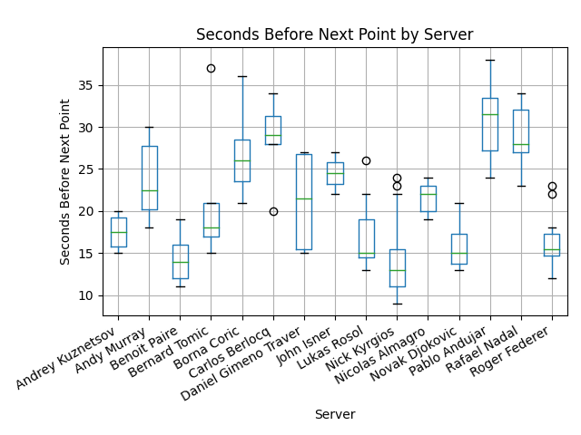
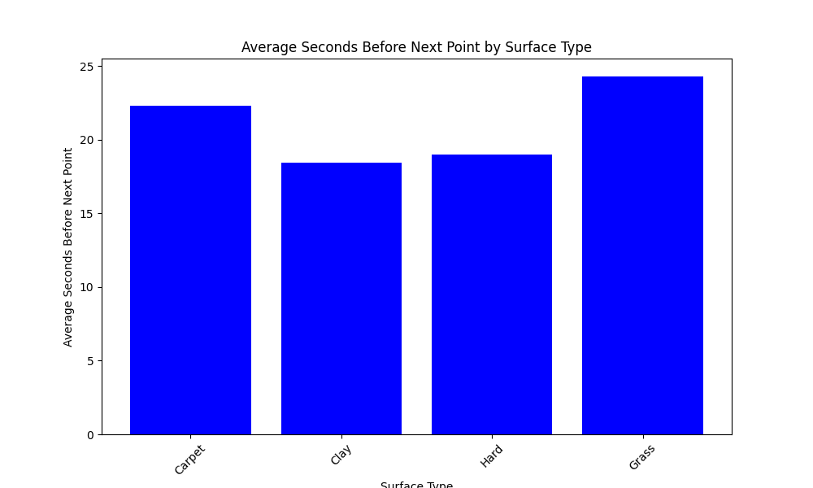

## Data Pipeline with Databricks

**Overview:**
The Data Extraction and Transformation Pipeline project aims to retrieve and process tennis match data from fivethirtyeight datasets, specifically using Databricks in conjunction with the Databricks API and various Python libraries.

**Key Components:**
1. **Data Extraction:**
   - Utilizes the `requests` library to fetch tennis match data from specified URLs.
   - Downloads and stores the data in the Databricks FileStore.

2. **Databricks Environment Setup:**
   - Establishes a connection to the Databricks environment using environment variables for authentication (SERVER_HOSTNAME and ACCESS_TOKEN).

3. **Data Transformation and Load**
    - Transform the csv file into a Spark dataframe which is then converted into a Delta Lake Table and stored in the Databricks environement

4. **Query Transformation and Vizulization:**
   - Defines a Spark SQL query to perform a predefined transformation on the retrieved data.
   - Uses the predifined transformation Spark dataframe to create vizualizations

5. **File Path Checking for `make test`:**
   - Implements a function to check if a specified file path exists in the Databricks FileStore.
   - As the majority of the functions only work exclusively in conjunction with Databricks, the Github environment cannot replicate and do not have access to the data in the Databricks workspace. I have opted to test whether I can still connect to the Databricks API. 
   - Utilizes the Databricks API and the `requests` library.

6. **Automated trigger via Github Push**:*
    - I utilize the Databricks API to run a job on my Databricks workspace such that when a user pushes to this repo it will intiate a job run 

**Preparation:**
1. Create a Databricks workspace on Azure 
2. Connect Github account to Databricks Workspace 
3. Create global init script for cluster start to store enviornment variables 
4. Create a Databricks cluster that supports Pyspark 
5. Clone repo into Databricks workspace 
6. Create a job on Databricks to build pipeline 
7. Extract task (Data Source): `mylib/extract.py`
8. Transform and Load Task (Data Sink): `mylib/transform_load.py`
9. Query and Viz Task: `mylib/query_viz.py`

## Job Run from Automated Trigger:

## Check format and test errors
1. Open codespaces or run repo locally with terminal open 
2. Format code `make format`
3. Lint code `make lint`

## Sample Viz from Query: 

## References 
1. https://github.com/nogibjj/python-ruff-template
2. https://hypercodelab.com/docs/spark/databricks-platform/global-env-variables
3. https://docs.databricks.com/en/dbfs/filestore.html
4. https://learn.microsoft.com/en-us/azure/databricks/delta/
5. https://learn.microsoft.com/en-us/training/paths/data-engineer-azure-databricks/
6. https://docs.databricks.com/en/getting-started/data-pipeline-get-started.html

